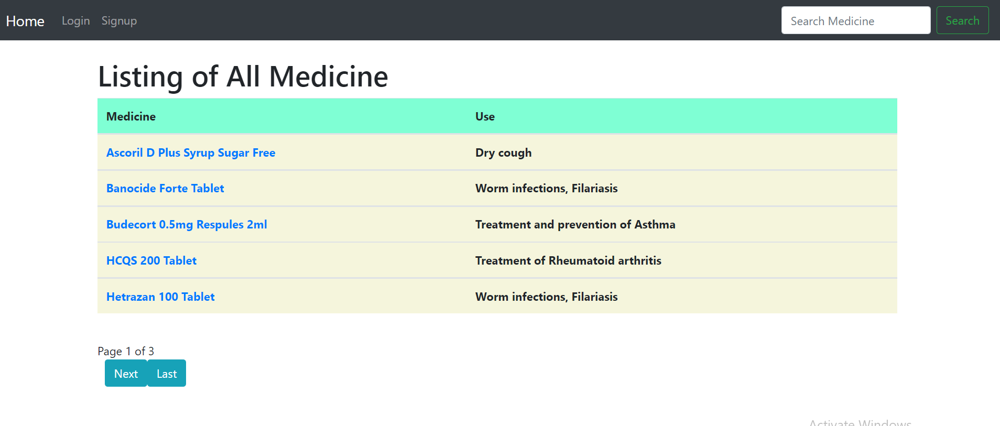
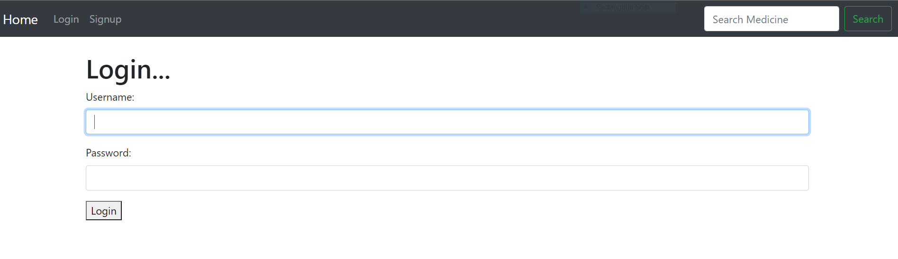
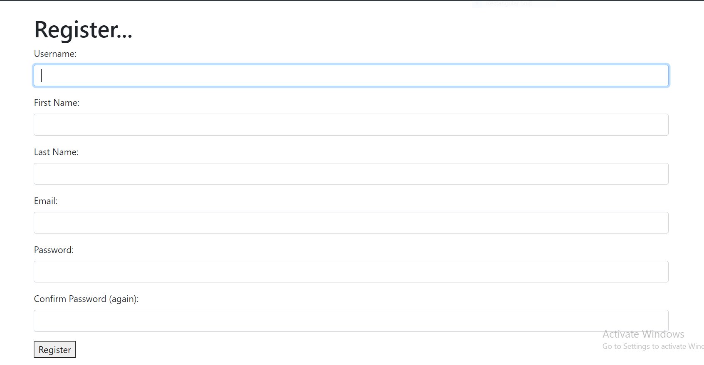
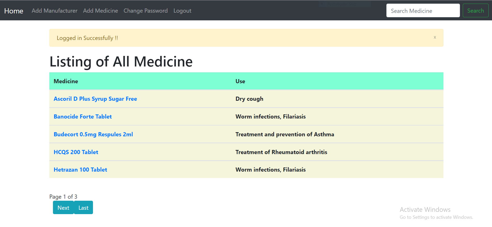
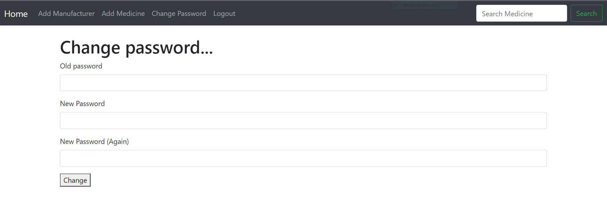

# Healthcare System
Healthcare systems are responsible for delivering services that improve, maintain or restore the health of individuals and their communities.

# About Project
This is a website for inventory of Medicines  and it's uses using Django.A user can login, register, changepassword and logout.A dummy Admin user can add medicine and also add medicine manufactures.

## Features
  - Add Manufacturer
      - Add a Medicine Manufacturer (Admin Can add a Medicine Manufacturer)
  - Add Medicine
      -  Add Medicine (Admin can add a Medicine in system)
      -  Also, add details for the medicine such as Price, Use of Medicine, Benefits, Side effects, Safety Advice, and 1 picture".
      -  Associate Medicine with a Manufacturer
      -  Associate substitute with other Medicines (There can be multiple substitutes for a single Medicine)
  - Medicine Fetch / Search by keyword
      - Fetch the Medicine along with it's associated manufacturer.
      - If the search parameter is passed, then filter the result accordingly, else fetch all. (Search parameters include Medicine name, Manufacturer name etc..)
  - Authentication
      - Have an Login Feature (You can create a dummy Admin user credentials in the Database)
      - Register feature
      - Changed password feature
      - logout feature
  - Apply pagination (i.e Each page contains only list of five medicine)
  - **Frontend / Template : -**
      - **Screen #1**
           - Show a Search box
           - Show All Medicine by default, if user search for a specific Medicine/Manufacturer then load the result accordingly (below the search box)
      - **Screen #2**
           - Upon clicking of any Medicine from screen #1, Load specific Medicine detail page
           
      - [You can go through this link for reference click here](https://www.1mg.com/drugs-all-medicines)
     
### Tech Stack
 - Python, Django,Html, CSS, Bootstrap

## Output

   
  
  
 
 

## Acknowledgements/Prerequisites
- **Python IDE**
   - [VS Code (Visual Studio Code)](https://code.visualstudio.com/docs/?dv=win)
   - Install following extensions : -
       - Python
       - Code runer
- [Download Python and Install](https://www.python.org/downloads/)
- python.exe path must be set in 'path' environment variable
- For more details link are given below:-
  - [How to download Python and Pycharm](https://www.youtube.com/watch?v=mbryl4MZJms&ab_channel=Telusko)
  - [Download Pycharm](https://www.jetbrains.com/pycharm/download/#section=windows)

### Some Basic Commands ###
- To check python latest version: `` python --version ``
- To check pip: `` pip --version `` 
- To check all packages in your system: `` pip freeze ``
- To check Django install in your sytem or not,type: `` django-admin --version ``

### Initial setup to build Django Project ###
- First we need to create a virtual environment.Using a virtual environment avoids installing Django into a global python environment and we will have exact control over the libraries used in an application.
    - **Step-1:-** Create a project folder on file system like 'Project-django' and open inside VS code.
    - **Step-2:-** Install django in Separate environment.
- We can create virtual environment two ways.
- **First way (Open CMD or Terminal)**
    1. Install virtual environment wrapper :  `` pip install virtualenvwrapper-win ``
    2. Create a new virtual environment : `` mkvirtualenv Env_Name `` Example : ``mkvirtualenv healthcare_env``
    3. To activate virtual environment : `` workon Env_Name `` Example : ``workon healthcare_env``
    4. Install Django : `` pip install django ``
    - [How to setup virtual environment for Django project](https://www.youtube.com/watch?v=F_xWv0Q_dLE&ab_channel=GeekyShows)
    - Using this, virtual environment is install in your default working directory(C Drive).In **Envs** folder virtual environment(Env_Name) is present.
    - **Note : -** In terminal virtual environment not seen.In CMD virtual environment see after activate it.To deactivate virtual environment simply type `` deactivate`` and to delete virtual environement ,type ``rmvirtualenv Env_Name`` and Uninstall django,type ``pip uninstall django``
    
 - **Another way to create virtual environment (Open terminal or CMD)**
    1. Create a new virtual environment: `` python -m venv Env_Name ``
    2. To activate virtual environment: `` Env_Name\Scripts\activate.bat`` But on Unix or MacOS: ``source Env_Name/bin/activate`` 
    3. Install Django : `` pip install django ``
      - [How to setup virtual environment for Django project](https://www.youtube.com/watch?v=APOPm01BVrk&ab_channel=CoreySchafer)
      - Using this way, virtual environment is install in your current directory.
      - **Note : -** In terminal virtual environment not seen.In CMD virtual environment see after activate it.To deactivate virtual environment simply type `` deactivate`` and to delete virtual environement ,type ``rmdir Env_Name /s`` and Uninstall django,type ``pip uninstall django``

### After Initial setup ###
 1. Activate virtual environment : `` workon Env_Name``
 2. Create Django Project : `` django-admin startproject PROJECT_NAME``
 3. Create Django Application : `` python manage.py startapp APPLICATION_NAME ``
 4. Install your application in ``settings.py `` file.
 5. Run the sever : `` python manage.py runserver ``
 6. Open website in browser at ``http://localhost:8000`` or admin at ``http://localhost:8000/admin``
 7. Quit the server : ``ctrl+c``

